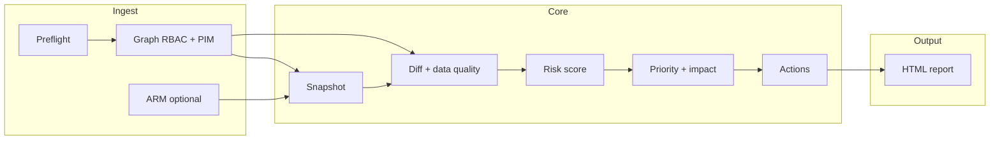

# Product thinking: IAM Risk Digest

This document explains **why** the tool is shaped the way it is. For install and run steps, see [docs/User_guide.md](docs/User_guide.md). The original build specification lives in [README.md](README.md).

---

## Problem framing

Cloud identity permissions do not expire with tickets. Standing directory roles, subscription RBAC, and long-lived PIM activations drift away from what teams believe they have. That gap shows up in audits, incidents, and certifications—always expensively.

IAM Risk Digest exists to give a **non-IAM manager** a weekly, plain-language answer: what changed, what is risky, who should act, and how—without logging into multiple portals.

---

## Persona

**Primary:** IT Operations Manager or Engineering Manager (roughly 50–500 person orgs) accountable for operational and compliance risk without a dedicated identity security team.

**Secondary:** Cloud administrator who receives remediation text from the report.

The tool is **not** optimized as a convenience layer for identity engineers; they already have portals, KQL, and PIM UX. The manager constraint drives prioritization and wording.

---

## Why common tooling is not enough

- **PIM** is strong for roles under its workflow; it does not by itself narrate **direct** directory assignments or subscription RBAC for a non-expert reader.
- **Access Reviews** are cycle-based and configuration-heavy; they do not replace a **diff of actual technical state** each week.
- **Log Analytics / audit logs** are powerful but assume query literacy and high signal investment.

IAM Risk Digest **aggregates and interprets** a small, read-only slice of Graph (and optionally ARM) into a **single HTML artifact** suitable to forward.

---

## Deliberately not in v1

| Excluded | Rationale |
|----------|-----------|
| What-if / blast simulation | Depends on Resource Graph and tagging quality; wrong answers harm trust. Deferred until a validation story exists. |
| Email / ticketing integration | External failure surfaces and scope; file output stays reliable. |
| Hosted dashboard | Contradicts zero-infrastructure deployment; snapshots can feed a future UI. |
| Multi-tenant orchestration | Different auth and data model; single-tenant v1 first. |
| Database | Snapshots on disk match the “script + artifact” model. |

---

## Success criteria (v1)

- A manager can read **Decision Summary + Executive Summary** in a few minutes without Azure portal context.
- Elevated or drifting access is **classified and ranked**, not dumped as raw API rows.
- **Data quality** is explicit when PIM, ARM, or timing signals are incomplete.
- Output is **evidence-shaped** (timestamps, principals, roles, scopes) for access-review packets.

---

## Scoring and priority (implementation-aligned)

### Severity (`src/risk_scorer.py`)

Rule order is **first match wins**. High-signal classes (bypass, orphan, certain PIM states, very old PIM / `rbac_stale`) are ordered before softer rules. **`STALE_RBAC_THRESHOLD_HOURS`** controls both the **`rbac_new`** medium-vs-low age split and the threshold for **`rbac_stale`** standing-role posture findings emitted in `diff_engine.py`.

### Priority (`src/priority_engine.py`)

Composite score blends severity weight, capped age, and principal-type weight so the top three items in **Decision Summary** reflect **business urgency**, not raw chronology. **Thirty-day impact** blurbs are type-templated for the top three only.

### Standing RBAC review (`rbac_stale`)

Beyond “new vs removed” diffs, v1 flags **tier-0 style directory roles** that have been **standing longer than `STALE_RBAC_THRESHOLD_HOURS`**, so “nobody touched this Global Admin for six months” surfaces even when nothing changed between snapshots. Assignments that **first appear this run** stay as **`rbac_new`** only (no duplicate stale row). Role names must resolve from Graph (see user guide if you still see GUIDs).

---

## Graph permissions (truth for this codebase)

**Application** permissions (admin consent):

| Permission | Role |
|------------|------|
| `Directory.Read.All` | Organization probe, expanded principals |
| `RoleManagement.Read.Directory` | Directory role assignments, PIM schedule instances, role definitions |

**Not required today:** `AuditLog.Read.All`. Event-delay transparency uses assignment `createdDateTime` / ARM `createdOn` as a **proxy**, not directory audit API. The in-report notice describes **assignment timestamp freshness**, not the audit log pipeline.

**ARM (optional):** subscription **Reader** (or equivalent read) for the service principal when `AZURE_SUBSCRIPTION_ID` is set.

---

## Report shape

The HTML report has **five** sections: Decision Summary (top three), Executive Summary, What Changed, Prioritized Action Items, Full Audit Log. Every run—including **baseline**—writes a report so week one is still a governance artifact.

---

## Roadmap (intent only)

- **v2:** Delivery (email), ticketing hooks, multi-tenant, richer history from stored snapshots.
- **v3:** Resource Graph–backed impact simulation **only** with reliability gates.

---

## Processing overview

---

## Local constraints

Single tenant per `.env`, read-only APIs, writes only under `snapshots/` and `reports/`, no credentials in source.
