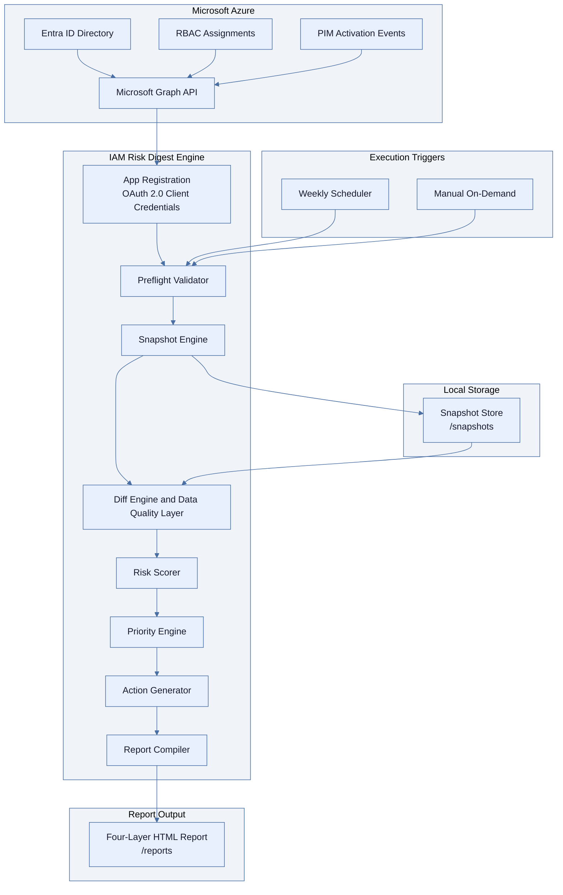

# IAM Risk Digest

An automated identity governance tool that tells IT and Engineering Managers what changed in their cloud access environment, what the risk exposure is, and exactly what to do about it, without requiring a dedicated security team to interpret the output.

---

## The Problem

Cloud access permissions accumulate silently. An engineer gets elevated access during an incident, the incident closes, and the access stays. A startup moves fast and grants broad permissions because scoping them correctly can wait. A PIM activation runs past its intended window because nobody tracks when it was supposed to end. None of this feels urgent until a security audit, a compliance review, or an actual breach makes it urgent, at which point the remediation is expensive and the damage may already be done.

The tooling that exists for this problem speaks to security engineers, not to the managers who carry the organizational risk. Microsoft's native access review features require manual setup per cycle, produce output that assumes IAM expertise, and do not combine directory role data with PIM activation data in a single readable view. The gap between tooling that exists and managers having actionable visibility is what this project addresses.

---

## What It Does

IAM Risk Digest connects to your Azure Entra ID tenant via Microsoft Graph API, pulls a snapshot of all current role assignments and active PIM sessions, and compares it against the previous snapshot to identify what changed. It scores each change by severity, identifies the three highest-priority risks across the full finding set, generates plain-language action items with specific remediation instructions, and writes a structured HTML report.

The report is produced on a scheduled cadence or triggered manually after an incident. It does not require the manager to log into any portal, run any query, or understand the underlying identity model. The output has four layers: a decision summary with the top three prioritized risks, an executive summary with overall risk score, a change log with all findings, a prioritized action list with remediation commands, and a full audit trail suitable for compliance evidence.

The scheduler runs as a background process on any machine with Python installed. In v1, the report is written to a local `/reports` directory. Refer to `docs/scheduling.md` for instructions on running the scheduler persistently via cron, Task Scheduler, or Azure Automation, and for options to deliver the report to a shared folder or email it to the manager automatically.

---

## System Architecture



---

## How to Use

### Prerequisites

Before running the tool, you need a Microsoft 365 Developer tenant or an Azure account with an active Entra ID directory, an app registration in Entra ID with the following Microsoft Graph API application permissions granted and admin consent approved: `RoleManagement.Read.All`, `AuditLog.Read.All`, and `Directory.Read.All`. You will also need Python 3.10 or later installed locally.

If you need to set up a demo environment from scratch, refer to `docs/environment-setup.md`.

### Setup

Clone the repository and create a virtual environment:

```bash
python -m venv venv
source venv/bin/activate       # Mac / Linux
venv\Scripts\activate          # Windows
pip install -r requirements.txt
```

Copy `.env.example` to `.env` and populate it with your credentials:

```
AZURE_TENANT_ID=           # Your Entra ID tenant ID
AZURE_CLIENT_ID=           # App registration client ID
AZURE_CLIENT_SECRET=       # App registration client secret
AZURE_SUBSCRIPTION_ID=     # Optional, leave blank if not using ARM RBAC
STALE_PIM_THRESHOLD_HOURS=24
STALE_RBAC_THRESHOLD_HOURS=48
```

Before running the full tool, verify your credentials are working:

```python
import msal, os
from dotenv import load_dotenv
load_dotenv()

app = msal.ConfidentialClientApplication(
    os.getenv("AZURE_CLIENT_ID"),
    authority=f"https://login.microsoftonline.com/{os.getenv('AZURE_TENANT_ID')}",
    client_credential=os.getenv("AZURE_CLIENT_SECRET")
)
result = app.acquire_token_for_client(scopes=["https://graph.microsoft.com/.default"])
print("Connected" if "access_token" in result else result.get("error_description"))
```

### Running the Tool

**First run, establishes the baseline snapshot:**
```bash
python run_digest.py --run-now
```

No drift report is generated on the first run because there is no previous state to compare against. The tool confirms it has saved a baseline and prompts you to run again after access changes have occurred.

**Subsequent runs, generates the full report:**
```bash
python run_digest.py --run-now
```

The HTML report is written to `/reports/iam_digest_{date}.html`. Open it in any browser. No login or additional software required.

**Start the scheduled runner:**
```bash
python run_digest.py --schedule
```

This starts a process that fires on the cadence set in `REPORT_CADENCE_DAYS`. The process must remain active for scheduling to work. See `docs/scheduling.md` for how to run this persistently.

**Verbose output for debugging:**
```bash
python run_digest.py --run-now --verbose
```

### Expected Output

```
[INFO] Preflight validation passed. PIM: configured. ARM: not configured.
[INFO] Pulled 47 Graph RBAC assignments, 12 PIM activations.
[INFO] Loaded previous snapshot: snapshots/snapshot_2025-01-08T10:00:00Z.json
[INFO] Data quality: PIM available, ARM not configured, 0 signal conflicts, no event delay.
[INFO] Diff complete: 3 high, 2 medium, 4 low findings.
[INFO] Priority engine: top 3 selected and ranked.
[INFO] Report written to: reports/iam_digest_2025-01-15.html
Summary: 9 findings | 3 HIGH | 2 MEDIUM | 4 LOW | Actions required: 5
```
