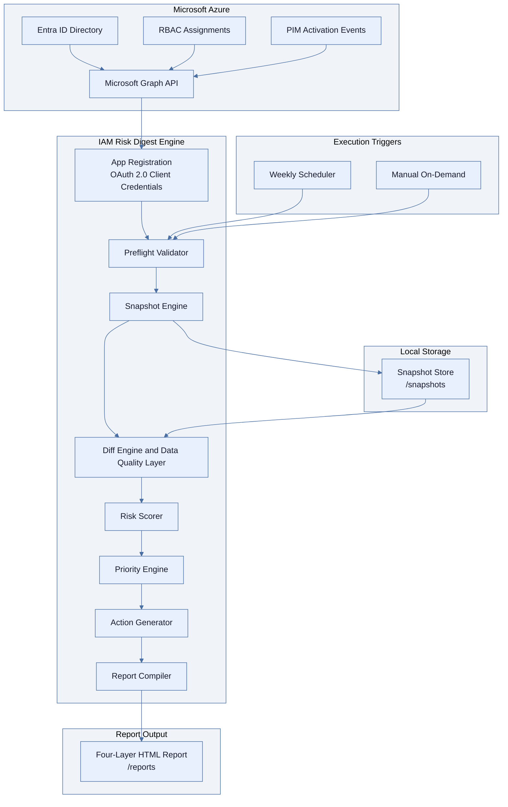

# IAM Risk Digest

---

## Objective

Build a Python-based automated governance tool called **IAM Risk Digest**. The tool connects to Microsoft Azure via Microsoft Graph API, pulls identity and access data, compares it against a previously saved snapshot, scores the findings by severity, ranks them using a composite priority engine, generates plain-language action items with specific remediation commands, and produces a structured **five-section** HTML report (Decision Summary, Executive Summary, What Changed, Prioritized Action Items, Full Audit Log) that a non-technical IT or Engineering Manager can read and act on without IAM expertise. **Every run writes a report**, including the baseline run (no prior snapshot), as a governance artifact.

This is not a dashboard or web application. It is a script that runs on a schedule or on demand and produces a self-contained HTML report file as its output.

---

## Shipping status (implemented code)

This repository contains the **runnable** IAM Risk Digest implementation (not only a specification).

| Audience | Document |
|----------|----------|
| Operators (permissions, `.env`, first run, testing) | [docs/USER_GUIDE.md](docs/USER_GUIDE.md) |
| Product rationale, persona, exclusions, scoring | [PRODUCT_THINKING.md](PRODUCT_THINKING.md) |
| Tenant / demo pointers | [docs/environment-setup.md](docs/environment-setup.md) |
| Cron / Task Scheduler | [docs/scheduling.md](docs/scheduling.md) |

The **Objective** section onward preserves the original Cursor build specification for traceability.

---

## Tech Stack
An automated identity governance tool that tells IT and Engineering Managers what changed in their cloud access environment, what the risk exposure is, and exactly what to do about it, without requiring a dedicated security team to interpret the output.

---

## The Problem

Cloud access permissions accumulate silently. An engineer gets elevated access during an incident, the incident closes, and the access stays. A startup moves fast and grants broad permissions because scoping them correctly can wait. A PIM activation runs past its intended window because nobody tracks when it was supposed to end. None of this feels urgent until a security audit, a compliance review, or an actual breach makes it urgent, at which point the remediation is expensive and the damage may already be done.

The tooling that exists for this problem speaks to security engineers, not to the managers who carry the organizational risk. Microsoft's native access review features require manual setup per cycle, produce output that assumes IAM expertise, and do not combine directory role data with PIM activation data in a single readable view. The gap between tooling that exists and managers having actionable visibility is what this project addresses.

---

## What It Does

IAM Risk Digest connects to your Azure Entra ID tenant via Microsoft Graph API, pulls a snapshot of all current role assignments and active PIM sessions, and compares it against the previous snapshot to identify what changed. It scores each change by severity, identifies the three highest-priority risks across the full finding set, generates plain-language action items with specific remediation instructions, and writes a structured HTML report.

```
iam-risk-digest/
├── .env.example
├── .gitignore
├── requirements.txt
├── run_digest.py
├── test_connection.py
├── PRODUCT_THINKING.md
├── src/
│   ├── __init__.py
│   ├── config.py
│   ├── auth.py
│   ├── preflight.py
│   ├── graph_client.py
│   ├── arm_client.py
│   ├── subscription_util.py
│   ├── snapshot.py
│   ├── diff_engine.py
│   ├── risk_scorer.py
│   ├── priority_engine.py
│   ├── action_generator.py
│   └── report_compiler.py
├── templates/
│   └── report.html.j2
├── snapshots/
│   └── .gitkeep
├── reports/
│   └── .gitkeep
└── docs/
    ├── scheduling.md
    ├── USER_GUIDE.md
    └── environment-setup.md
```

The scheduler runs as a background process on any machine with Python installed. In v1, the report is written to a local `/reports` directory. Refer to `docs/scheduling.md` for instructions on running the scheduler persistently via cron, Task Scheduler, or Azure Automation, and for options to deliver the report to a shared folder or email it to the manager automatically.

- **`STALE_PIM_THRESHOLD_HOURS`** — After how many hours an **active** PIM assignment (no end, or end in the future) is flagged as `pim_stale`. Also sets the lower bound for the **`pim_no_justification`** age window; the upper bound is **twice** this value (justification empty).
- **`STALE_RBAC_THRESHOLD_HOURS`** — (1) **Medium vs low** severity split for `rbac_new` (assignment age since `createdDateTime`). (2) **Standing review:** emits **`rbac_stale`** for tier-0 directory roles (see `_STANDING_RBAC_REVIEW_ROLE_NAMES` in `src/diff_engine.py`) when the assignment is **not new this cycle**, `createdDateTime` is known, and standing age **exceeds** this threshold.

---

## Microsoft Graph application permissions (implemented)

The app registration uses the **OAuth 2.0 client credentials** flow. Grant these **Microsoft Graph → Application** permissions and **admin consent**:

| Permission | Purpose |
|------------|---------|
| **Directory.Read.All** | Preflight `/organization`; `$expand=principal` on directory role assignments |
| **RoleManagement.Read.Directory** | Directory role assignments, PIM schedule instances, role definitions (human-readable role names) |

**`AuditLog.Read.All`** is **not** required by the current code. The Data Quality “event delay” signal uses the latest **`createdDateTime` / `createdOn`** timestamps on assignments as a **proxy** for reporting lag; a future version may switch to `auditLogs/directoryAudits` if that permission is granted.

**Optional ARM:** when `AZURE_SUBSCRIPTION_ID` is set, grant the service principal at least **Reader** on that subscription so ARM RBAC can be listed.

**Connectivity check:** `python test_connection.py` (not `test_auth.py`).

---

## System Architecture



---

## How to Use

Responsibilities:
- Pull Entra ID directory role assignments: `GET .../roleManagement/directory/roleAssignments?$expand=principal` (Graph allows **only one** `$expand` target per request on these APIs). Resolve role display names via a separate paginated `GET .../roleManagement/directory/roleDefinitions?$select=id,displayName,templateId`, cached in-process for the run.
- Pull PIM activation instances: `GET .../roleAssignmentScheduleInstances?$expand=principal` with the same role-definition cache.
- Handle paginated responses by following `@odata.nextLink` until absent
- Handle 403 by raising `PermissionError` identifying the missing scope
- Handle 429 with exponential backoff, maximum three retries
- Return two lists of normalized dictionaries matching the snapshot schema

Before running the tool, you need a Microsoft 365 Developer tenant or an Azure account with an active Entra ID directory, an app registration in Entra ID with the following Microsoft Graph API application permissions granted and admin consent approved: `RoleManagement.Read.All`, `AuditLog.Read.All`, and `Directory.Read.All`. You will also need Python 3.10 or later installed locally.

If you need to set up a demo environment from scratch, refer to `docs/environment-setup.md`.

### Setup

Clone the repository and create a virtual environment:

```bash
python -m venv venv
source venv/bin/activate       # Mac / Linux
venv\Scripts\activate          # Windows
pip install -r requirements.txt
```

Copy `.env.example` to `.env` and populate it with your credentials:

```
AZURE_TENANT_ID=           # Your Entra ID tenant ID
AZURE_CLIENT_ID=           # App registration client ID
AZURE_CLIENT_SECRET=       # App registration client secret
AZURE_SUBSCRIPTION_ID=     # Optional, leave blank if not using ARM RBAC
STALE_PIM_THRESHOLD_HOURS=24
STALE_RBAC_THRESHOLD_HOURS=48
```

Before running the full tool, verify your credentials are working:

```python
@dataclass
class DataQuality:
    pim_data_available: bool
    arm_data_available: bool
    signal_conflict_count: int       # Roles removed in RBAC but still active in PIM log
    event_delay_detected: bool       # Assignment timestamps suggest >2h lag vs UTC (proxy; not Graph audit API)
    event_delay_hours: float | None  # Actual lag in hours if detected
```

Populate `DataQuality` before computing any findings. Pass it through to the report so the manager knows the coverage of the scan.

**Finding types to detect** (twelve types; `rbac_stale` is posture/review, not a net-new assignment delta):

| Finding type | Detection logic |
|---|---|
| `rbac_new` | In current snapshot, absent in previous |
| `rbac_removed` | In previous snapshot, absent in current |
| `rbac_escalated` | Scope changed from resource group to subscription level |
| `rbac_stale` | Not baseline; assignment id **not** in this run’s “new” set; role display name in tier-0 review list (`_STANDING_RBAC_REVIEW_ROLE_NAMES` in `diff_engine.py`); `createdDateTime` known; standing age **>** `STALE_RBAC_THRESHOLD_HOURS` |
| `rbac_orphaned` | Principal appears deleted or unresolvable (`$expand=principal` yields unknown / display equals id) |
| `rbac_pim_bypass` | Direct Owner or Contributor assignment where PIM is configured |
| `pim_stale` | Activation age exceeds `STALE_PIM_THRESHOLD_HOURS` and end time is null or future |
| `pim_no_justification` | Justification null or empty; activation age between **`STALE_PIM_THRESHOLD_HOURS`** and **twice** that value (inclusive) |
| `pim_repeated` | Three or more activations by same principal for same role within 7-day window |
| `pim_eligible_and_active` | Same principal has both eligible and permanent active assignment for same role |
| `pim_absent` | PIM not configured in tenant (from preflight) |
| `service_principal_elevated` | ServicePrincipal holds Owner or Contributor in any scope |

- For `pim_repeated`: group all activations into one finding with an `activation_count` field
- If previous snapshot is None: return empty `DiffResult` with `is_baseline_run = True`

---

**First run, establishes the baseline snapshot:**
```bash
python run_digest.py --run-now
```

---

### `src/risk_scorer.py`

Assign severity using the following rules in order. First match wins.

| Rule | Severity |
|---|---|
| `rbac_pim_bypass` | high |
| `rbac_orphaned` | high |
| `service_principal_elevated` | high |
| `pim_stale` and `age_hours` >= 168 | high |
| `pim_eligible_and_active` | high |
| `rbac_stale` and `age_hours` >= 168 | high |
| `rbac_new` and `age_hours` >= `STALE_RBAC_THRESHOLD_HOURS` | medium |
| `rbac_stale` and `age_hours` < 168 | medium |
| `pim_stale` and `age_hours` >= 24 | medium |
| `pim_no_justification` | medium |
| `pim_repeated` | medium |
| `pim_absent` | medium |
| `rbac_new` and `age_hours` < `STALE_RBAC_THRESHOLD_HOURS` | low |
| `rbac_removed` | low |
| All others | low |

---

### `src/priority_engine.py`

This is a new module. Its job is to rank all findings by business urgency and select the top three for the Decision Summary section of the report.

**Composite scoring formula:**

```
priority_score = (severity_weight × 4) + min(age_hours / 24, 15) + principal_type_weight

severity_weight:        high = 10, medium = 5, low = 1
age_weight (in code):   min(age_hours / 24, 15)   # capped at 15 days of age-equivalent contribution
principal_type_weight:  ServicePrincipal = 5, User = 2, Group = 1
```

The severity weight is multiplied by **4** in code so high-severity items stay ahead of old low-severity noise; age is **capped** so very old findings do not dominate the score indefinitely. Ties are broken by severity descending, then age descending.

**Responsibilities:**
- Accept the full scored finding list from `risk_scorer.py`
- Compute `priority_score` for each finding and set the `priority_rank` field (1 = highest)
- Select the top three findings by priority score
- For each of the top three, populate `projected_impact` with a plain-English sentence describing the organizational risk if this finding remains unresolved for 30 days

**Projected impact language by finding type:**

| Finding type | Impact projection template |
|---|---|
| `rbac_pim_bypass` | "If unresolved for 30 days, this standing privileged assignment continues to bypass your just-in-time controls, increasing exposure in any incident or audit during that period." |
| `rbac_orphaned` | "If unresolved for 30 days, access belonging to a disabled account remains an active attack vector for credential-based entry into this role." |
| `service_principal_elevated` | "If unresolved for 30 days, a non-human identity with broad permissions continues to represent an unmonitored lateral movement risk across all resources in this scope." |
| `pim_stale` | "If unresolved for 30 days, elevated access that was intended as temporary becomes indistinguishable from a standing assignment, undermining the purpose of your PIM controls." |
| `rbac_new` (medium) | "If unresolved for 30 days, an unconfirmed access change will appear in your next compliance review without a documented business justification." |
| `pim_eligible_and_active` | "If unresolved for 30 days, this role is effectively ungoverned — the permanent active assignment bypasses the activation workflow that PIM was configured to enforce." |
| `pim_repeated` | "If unresolved for 30 days, the repeated activation pattern will continue to generate noise in the audit log, masking other changes that may require attention." |
| `pim_absent` | "Without PIM, all privileged access in this tenant operates on a standing basis. Every day without JIT controls is a day where over-provisioned access cannot be time-bounded or justified on demand." |
| `rbac_stale` | "If unresolved for 30 days, standing privileged access continues without a documented review cycle, increasing audit and incident exposure." |

- For finding types not listed above, use: "If unresolved for 30 days, this finding will persist as an open risk item in future review cycles."
- Return the full finding list (all findings, with `priority_rank` and `priority_score` populated on every item, and `projected_impact` populated only on the top three)

---

### `src/action_generator.py`

Responsibilities:
- Populate `action_item`, `remediation_command`, and `recommended_owner` on each finding
- `action_item` is a plain-English sentence the manager can read and forward. No technical jargon, no internal type codes.
- `remediation_command` is a specific, copy-pasteable instruction for the Cloud Administrator. It should name the exact portal, navigation path, and action — not just describe the outcome.
- `recommended_owner` is one of: `Cloud Administrator`, `Security Team`, `Manager Review`, `IT Operations`

**Mapping:**

| Finding type | Action item | Remediation command | Owner |
|---|---|---|---|
| `rbac_pim_bypass` | "This privileged role was assigned directly, bypassing your just-in-time access controls. The assignment should be converted to a PIM-eligible assignment and the direct active assignment removed." | "In Entra PIM, navigate to Azure AD Roles > [role name] > Assignments. Add [principal] as Eligible with max activation duration 4 hours and justification required. Then remove the Active assignment for the same principal." | Cloud Administrator |
| `rbac_orphaned` | "This role assignment belongs to an account that has been disabled. It should be removed immediately as it represents an access vector that no active user controls." | "In Entra portal, navigate to Roles and Administrators > [role name]. Find and remove the assignment for principal ID [principal_id]. Confirm the account is disabled in Users before removing." | Cloud Administrator |
| `service_principal_elevated` | "A service principal holds a broad role that may exceed what the application actually requires. The scope should be reviewed and reduced to the minimum necessary permissions." | "In Azure portal, navigate to the resource at [scope] > Access Control (IAM). Remove the [role] assignment for [principal_display_name]. Create a custom role scoped to only the operations this application requires and reassign." | Security Team |
| `pim_stale` | "A PIM activation is still active beyond its expected window. Confirm whether the access is still needed and deactivate it if not." | "In Entra PIM, navigate to Azure AD Roles > Active Assignments. Locate [principal_display_name] in [role_definition_name] and select Deactivate. If access is still required, have the user re-activate with a new justification and appropriate duration." | Manager Review |
| `pim_eligible_and_active` | "This principal has both a PIM-eligible assignment and a permanent active assignment for the same role. The permanent assignment defeats the purpose of PIM and should be removed." | "In Entra PIM, navigate to Azure AD Roles > [role name] > Assignments. Under Active assignments, remove the permanent assignment for [principal_display_name]. The Eligible assignment should remain." | Cloud Administrator |
| `rbac_new` (any age) | "A new role assignment was created recently and has not been confirmed as intentional. Verify the business justification before the next review cycle." | "In Entra portal, navigate to Roles and Administrators > [role name]. Confirm the assignment for [principal_display_name] was authorized. Document the business justification in your access review log." | Manager Review |
| `rbac_escalated` | "An existing assignment was escalated from a resource group scope to subscription scope. Confirm this expansion was intentional and aligns with least privilege." | "In Azure portal, navigate to the subscription > Access Control (IAM). Review the [role] assignment for [principal_display_name]. If the broader scope is not required, remove it and reinstate the assignment at the original resource group scope." | Manager Review |
| `rbac_stale` | "This privileged directory role has been assigned as a standing assignment longer than your configured review threshold. Confirm it is still required, documented, and appropriate for least privilege." | "In Entra portal, navigate to Roles and Administrators > [role name]. Review the assignment for [principal_display_name]. If the access is still needed, document the business justification and next review date. If PIM is enabled for this role, convert the assignment to Eligible-only and remove the permanent Active assignment." | Manager Review |
| `pim_no_justification` | "A PIM activation was made without a documented justification. Follow up with the user to understand the reason for the activation." | "In Entra PIM, navigate to the audit log and locate the activation event for [principal_display_name] in [role_definition_name]. Contact the user to document the reason. Consider enabling justification as a required field in the PIM role settings." | IT Operations |
| `pim_repeated` | "The same user has activated this privileged role multiple times in the past week. Evaluate whether repeated activation justifies making this role permanently eligible or whether a process gap exists." | "In Entra PIM, navigate to Azure AD Roles > [role name] > Settings. Review the activation policy. If frequent access is legitimate, consider increasing max activation duration. If the pattern is unexpected, review the user's recent activity in the audit log." | Security Team |
| `pim_absent` | "Privileged Identity Management is not configured in this tenant. All privileged access is currently standing rather than just-in-time, which increases exposure." | "In Entra portal, navigate to Privileged Identity Management. Enable PIM for Azure AD Roles. Begin by assigning the highest-privilege roles (Global Administrator, Privileged Role Administrator) as Eligible-only. Schedule a follow-up to extend PIM coverage to all privileged roles within 30 days." | Security Team |
| `rbac_removed` | "A role assignment was removed. Confirm this removal was intentional and that it occurred as part of a planned offboarding or role change." | "In Entra portal, navigate to the audit log and locate the removal event for [principal_display_name] in [role_definition_name]. Confirm the removal was authorized. No further action required if intentional." | IT Operations |

For `pim_repeated`, replace `activation_count` placeholder with the actual count from the finding: "activated [n] times in the past 7 days."

---

### `src/report_compiler.py`

Responsibilities:
- Accept the `DiffResult`, `DataQuality`, `PreflightResult`, and current snapshot metadata
- Compute overall risk score: any high finding = HIGH, any medium (no high) = MEDIUM, low or none = LOW
- Render `templates/report.html.j2` with all data
- Write output to `/reports/iam_digest_{ISO_date}.html`
- The report must be fully self-contained with all styles in a `<style>` block. No external dependencies.
- **Data Quality** copy in the Executive Summary must stay neutral: PIM/ARM gaps, signal conflicts, and **assignment-timestamp freshness** (not Graph audit log API unless extended later).

---

### `templates/report.html.j2`

Build a clean, professional HTML report with five sections in this order:

**Section 0: Decision Summary**

Appears only when findings exist and is not a baseline run. Contains exactly three items — the top three findings from the priority engine.

For each of the three, display:
- A numbered rank badge (01, 02, 03) in a large muted format
- The principal name and role in bold
- The `action_item` text
- The `projected_impact` text in a muted italic style below the action
- The `recommended_owner` label in a pill on the right

Header of this section: "Start here. These are the three findings that matter most this week."

**Section 1: Executive Summary**

- Overall risk score as a large colored badge (red = HIGH, amber = MEDIUM, green = LOW)
- Scan date and period covered
- Three metric cards: total findings, high-severity count, actions required
- One plain-English sentence summarizing the most critical finding, or "No access drift detected in this review period" if clean
- If `is_baseline_run` is True: a prominent notice that this is a baseline run and explains that drift comparison begins on the next run
- Data Quality Notice: if any `DataQuality` field is non-nominal, render a bordered notice block listing which signals were unavailable or degraded and what that means for coverage. Use neutral language — this is transparency, not an error.

**Section 2: What Changed**

Chronological table with columns: Principal, Role, Scope, Change Type (human-readable, not the internal type code), Detected At, Severity badge.

Human-readable change type labels:

| Internal type | Display label |
|---|---|
| `rbac_new` | New Assignment |
| `rbac_removed` | Assignment Removed |
| `rbac_escalated` | Scope Escalated |
| `rbac_stale` | Standing Role Past Review Threshold |
| `rbac_orphaned` | Orphaned Access |
| `rbac_pim_bypass` | PIM Bypass |
| `pim_stale` | Stale PIM Activation |
| `pim_no_justification` | Unjustified Activation |
| `pim_repeated` | Repeated Activations |
| `pim_eligible_and_active` | Duplicate Assignment |
| `pim_absent` | PIM Not Configured |
| `service_principal_elevated` | Elevated Service Principal |

If no findings: display "No changes detected since the last review."

**Section 3: Prioritized Action Items**

Numbered list of all high and medium findings, sorted by priority rank ascending.

Each item displays:
- Priority rank number (if in top 3, show the rank badge prominently)
- Severity badge
- Principal name and role in bold
- `action_item` text
- `remediation_command` in a monospace-styled block, visually distinct, preceded by the label "How to fix:"
- `recommended_owner` in a muted right-aligned label

Low-severity findings appear in a collapsed `<details>` block below, labeled "Low priority items ([count])".

**Section 4: Full Audit Log**

Complete table of all findings including low severity. Columns: Principal, Type, Role, Scope, Severity, Detected At, Age, Owner, Action.

A notice at the top: "This log contains a complete record of all access changes detected in this review period. It is suitable for use as compliance evidence and access review documentation."

All datetime fields formatted as: "15 Jan 2025, 10:42 UTC"

**Styling rules:**

- System font stack (no external fonts)
- White background, light gray section borders
- Severity colors: HIGH = #DC2626, MEDIUM = #D97706, LOW = #16A34A
- Priority rank badges: large (2rem), muted gray numerals
- Remediation command blocks: `font-family: monospace`, `background: #f8f8f8`, `border-left: 3px solid #D97706`, `padding: 12px`
- Fully print-safe (no fixed positioning, no heavy backgrounds that break PDF export)
- Readable without JavaScript

---

### `run_digest.py`

Entry point. Orchestrates the full execution pipeline:

1. Load `.env` with `python-dotenv`
2. Parse CLI args with `argparse`:
   - `--run-now`: immediate one-off run
   - `--schedule`: start weekly scheduler
   - `--verbose`: set logging to DEBUG
   - Default (no flags): print usage
3. On execution:
   - Run preflight — halt on failure
   - Pull from `graph_client` and `arm_client`
   - Load previous snapshot via `snapshot.py`
   - Save current snapshot
   - Run `diff_engine` — receive `DiffResult` and `DataQuality`
   - Run `risk_scorer`
   - Run `priority_engine`
   - Run `action_generator`
   - Run `report_compiler` — write HTML
   - Print path to report and finding summary
4. All exceptions caught at top level with clear messages. No silent failures.

---

## Edge Cases

**No previous snapshot (first run)**
- `load_latest_snapshot()` returns None
- `DiffResult` returns empty findings with `is_baseline_run = True`
- A **self-contained HTML report is still written** to `/reports` (governance artifact for week one)
- Section 0 (Decision Summary) is suppressed when there are no findings
- Section 1 shows the **baseline** notice: drift comparison begins on the next run
- Sections 2–4 show **no drift** messaging (empty tables / “no changes” copy), not a full live inventory export of every assignment

**PIM not configured**
- `pim_configured = False` from preflight
- `diff_engine` adds a single `pim_absent` finding at medium severity
- All PIM-specific finding types are skipped without error
- `DataQuality.pim_data_available = False`
- Section 1 Data Quality Notice explains PIM data was unavailable

**ARM subscription not configured**
- `AZURE_SUBSCRIPTION_ID` is empty
- `arm_client` returns empty list silently
- `DataQuality.arm_data_available = False`
- Section 1 Data Quality Notice notes ARM RBAC was not collected

**No changes detected**
- `DiffResult` has empty lists, `is_baseline_run = False`
- Report renders with LOW risk score, green badge, "No access drift detected" in all sections
- Section 0 is suppressed (no top-three to show)
- Report is still written to `/reports` as a governance artifact

**Service principals in assignments**
- Label as "(Service Principal)" next to display name everywhere in the report
- Apply `service_principal_elevated` detection regardless of Graph or ARM source

**Principal with no display name**
- Fall back to showing `principal_id`
- Do not skip the finding or raise an error

**Signal conflict detected**
- Role appears removed in RBAC snapshot but still active in PIM activation log
- Increment `DataQuality.signal_conflict_count`
- Surface both findings independently — do not suppress either
- Section 1 Data Quality Notice lists the count of conflicts detected

**Reporting lag (assignment-timestamp proxy)**
- Implementation compares the **newest** `createdDateTime` / `createdOn` across collected assignments to current UTC (not the Graph **audit log** API).
- If that gap exceeds 2 hours, set `DataQuality.event_delay_detected = True` and record `event_delay_hours`
- Section 1 Data Quality Notice uses wording equivalent to: Graph-related freshness may be **[N] hours** behind; very recent changes might not appear until the next run. Granting **`AuditLog.Read.All`** in the future could allow replacing this heuristic with a true audit tail query.

---

## Constraints

This starts a process that fires on the cadence set in `REPORT_CADENCE_DAYS`. The process must remain active for scheduling to work. See `docs/scheduling.md` for how to run this persistently.

**Verbose output for debugging:**
```bash
python run_digest.py --run-now --verbose
```

### Expected Output

```
[INFO] Preflight validation passed. PIM: configured. ARM: not configured.
[INFO] Pulled 47 Graph RBAC assignments, 12 PIM activations.
[INFO] Loaded previous snapshot: snapshots/snapshot_2025-01-08T10:00:00Z.json
[INFO] Data quality: PIM available, ARM not configured, 0 signal conflicts, no event delay.
[INFO] Diff complete: 3 high, 2 medium, 4 low findings.
[INFO] Priority engine: top 3 selected and ranked.
[INFO] Report written to: reports/iam_digest_2025-01-15.html
Summary: 9 findings | 3 HIGH | 2 MEDIUM | 4 LOW | Actions required: 5
```
