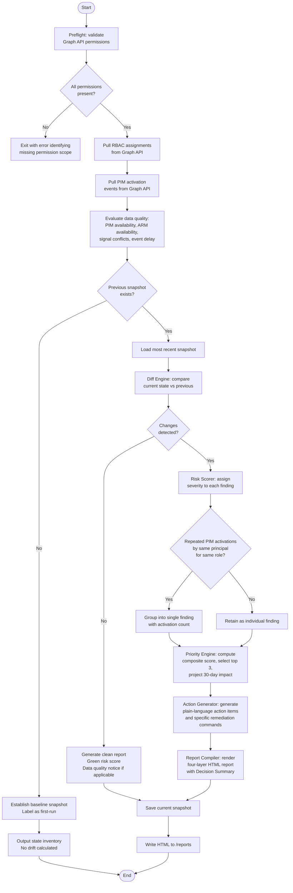

# Product Thinking: IAM Risk Digest

This document captures the reasoning behind every significant decision made in designing IAM Risk Digest, covering what problems were identified, what was considered, what was built, what was deliberately left out, and why. It is intended as a record of product thinking, not a feature list.

---

## Why This Problem

The starting point was not a solution. It was an observation made from working directly inside cloud infrastructure teams: access permissions are treated as a provisioning problem, not a lifecycle problem. The mental model most organizations operate under is that once access is granted correctly, the work is done. In practice, the access landscape drifts continuously from the moment it is set up.

Two patterns drive most of this drift. In organizations under operational pressure, access gets escalated during incidents because speed matters more than scope. The incident resolves. The access does not get walked back, because walking it back introduces risk and nobody owns the follow-up. In high-growth environments without mature identity governance, the pattern is structural. Broad permissions get granted because scoping them correctly is a problem for later, and later never arrives on its own.

The business consequence is not abstract. Over-permissioned standing access is consistently one of the primary vectors in cloud security incidents. Beyond breach risk, the compliance cost of unreviewed access is significant: SOC 2, ISO 27001, and NIST frameworks all require evidence of periodic access reviews, and organizations that cannot produce that evidence fail audits or spend disproportionate time and money manufacturing it retrospectively.

---

## What Already Exists and Why It Is Not Enough

Before defining a solution, the existing tooling landscape was mapped honestly.

Microsoft Privileged Identity Management handles just-in-time privileged access well for organizations that have fully adopted it. Its limitation is scope: PIM only governs roles assigned through its own workflows. Direct RBAC assignments made outside PIM, which are common in any environment that predates a PIM rollout or operates under time pressure, are invisible to PIM's reporting. Additionally, PIM's activation logs and assignment history are surfaced through the Entra portal in a format designed for identity engineers, not for the Engineering Manager whose name is on the audit report.

Entra ID Access Reviews support periodic review cycles but require manual setup for each cycle, produce output that assumes the reviewer understands role definitions and scope hierarchies, and offer no combined view of directory role assignments alongside PIM activation state. The reviewer is expected to bring context that most managers do not have.

Azure Monitor and Log Analytics are powerful but require KQL expertise to query. They are not designed to be operated by a manager, and the signal-to-noise ratio of raw logs is too low to be actionable without significant processing work.

The gap across all of these tools is the same: the output speaks to identity engineers. The person who carries organizational risk for that output is usually a manager who does not have that background and should not need it to make good decisions about their team's access posture.

---

## Market Segmentation and the v1 Target Decision

Early in the design process it became clear that this problem looks different depending on organizational context, and that the solution needed to make a deliberate choice about which version of the problem to solve first.

For startup-stage organizations (roughly 50 to 500 people), the acute pain is operational overhead. Access reviews are happening informally or not at all. There is no dedicated security function. The manager who needs to think about access governance is the same person managing infrastructure, oncall rotations, and hiring decisions. The value proposition for this segment is time recovery and structure, automated visibility that replaces ad hoc processes.

For enterprise and MNC-scale organizations, the acute pain is different. Security posture and compliance are formal concerns with dedicated owners. The value proposition is risk reduction and audit evidence, proof that access is reviewed on a regular cadence with documented findings and remediation actions.

The decision was made to target the startup segment as the primary v1 design constraint, with the enterprise segment served through the report's audit log layer without requiring the interface to be redesigned for them. The reasoning was practical: the startup environment is simpler to model, the problem is more visceral and immediate, and a tool that earns a manager's trust in a smaller organization will expand naturally into the enterprise use case. The reverse, building for enterprise first, tends to produce tools that are too complex for the environments where adoption is easiest.

This segmentation is reflected in the report structure. The decision summary, executive summary, and action list are designed for the startup manager who needs to act on findings without IAM expertise. The full audit log is designed for the compliance lead at an enterprise customer who needs evidence, not guidance.

---

## Persona Decision: Manager over Engineer

The original instinct was to build for the IAM Security Engineer, the person with the most technical context about identity risk. That instinct was reconsidered for a specific reason.

A security engineer is an individual contributor. They can navigate Entra ID directly, write queries against audit logs, and interpret role assignment scope hierarchies without assistance. Building a tool for them would narrow the product's reach, limit the business impact of the success metrics to individual-contributor productivity, and reduce the tool to a convenience layer over existing capabilities.

The IT Operations Manager or Engineering Manager, by contrast, owns the organizational risk. They are accountable for audit findings, sign off on compliance attestations, and have the authority to direct remediation. Designing for them forces the output to be clear, prioritized, and actionable, which is a harder design challenge than producing a technically complete report.

The engineer is still part of the workflow: they receive the remediation commands from their manager and execute them. But they are not the primary user. This distinction shapes every design decision downstream, particularly how findings are described, how actions are worded, and what the report's entry point looks like.

---

## OKRs

Three objectives were defined before any feature decisions were made. The order is intentional: overhead reduction is the primary driver for v1, exposure reduction is the natural consequence of the tool working as designed, and audit readiness is the benefit that accrues to organizations that run the tool consistently over time.

**Objective 1: Eliminate manual IAM tracking overhead for IT and Engineering Managers**

Access review cycle time, measured from the point a review is initiated to the point a report is ready for action, should be reduced by 70 percent. All RBAC and PIM access changes should be captured automatically without manual log aggregation. Managers should have no reliance on spreadsheet-based access tracking within 30 days of adoption.

**Objective 2: Reduce organizational exposure from unreviewed cloud access**

Stale elevated access, defined as any elevated role assignment unreviewed for more than 30 days, should be reduced by 80 percent within 60 days of the first remediation cycle. Mean time to detect access drift should be reduced from weeks to 24 hours, matching the weekly report cadence. No standing Owner or Contributor assignments outside PIM should remain flagged as unreviewed after the first remediation cycle completes.

**Objective 3: Make compliance evidence generation automatic and always available**

A full audit-ready access report should be generatable in under five minutes on demand. All access change events should be logged with principal identity, role, scope, and timestamp. The access review cadence should be maintained without manual initiation by the manager or their team.

---

## The Decision to Add a Priority Engine

An early version of the design produced a complete, well-organized report with no explicit guidance on where to start. Managers receiving a report with nine findings of varying severity face a prioritization problem that the tool was implicitly pushing back onto them. That is not decision support; it is information delivery.

The priority engine was added to close that gap. Its job is to answer the question every manager will ask first: if I can only act on three things this week, which three?

**Composite scoring formula:**

```
priority_score = (severity_weight × 4) + min(age_hours / 24, 15) + principal_type_weight

severity_weight:        high = 10, medium = 5, low = 1
age_weight:             min(age_hours / 24, 15)   [capped at 15 days]
principal_type_weight:  ServicePrincipal = 5, User = 2, Group = 1
```

**Why these weights**

The severity multiplier of 4 was chosen deliberately after verifying that it guarantees severity dominance over the maximum possible age and principal type contribution combined. A fresh high-severity finding must always outrank any low-severity finding regardless of how old it is. With a multiplier of 3, a 30-day-old low-severity service principal finding could mathematically outscore a fresh high-severity group finding, which contradicts the intent of the risk scorer's judgment. Raising the multiplier to 4 and capping age at 15 days eliminates that inversion.

The age cap at 15 days reflects the reality that urgency signal plateaus. A finding that has been present for two weeks is overdue regardless of whether it has been present for 15 days or 45 days. Allowing age to accumulate indefinitely would cause very old low-priority findings to crowd out more recent, higher-severity ones.

The principal type weights reflect blast radius and detectability rather than just risk level. A service principal scores 5 because non-human identities have no behavioral baseline, no MFA layer, no anomaly detection signal, and no HR-driven offboarding process. A compromised service principal is silent in ways that a compromised user account is not. A user account scores 2 because MFA, login anomaly detection, and offboarding processes provide meaningful mitigation layers even when access is over-provisioned. A group scores 1 because the risk is diffuse across all members rather than concentrated in a single identity, and group membership management is typically governed through a separate process.

Ties are broken by severity descending, then by age descending.

**Projected impact**

For each of the top three findings, the priority engine adds a plain-English impact projection describing the organizational risk if the finding remains unresolved for 30 days. This is not a guarantee; it is a structured estimate based on finding type, intended to make the cost of inaction concrete rather than abstract. Managers respond to consequence framing better than to severity labels alone.

---

## Data Quality and Designing for Uncertainty

A common failure mode in governance tooling is presenting incomplete data with complete confidence. When an API call fails silently, when a signal arrives late, or when two data sources contradict each other, a system that does not surface that uncertainty produces a false sense of coverage. A manager who believes they have reviewed all access changes because the report showed no issues, when in fact the ARM data was not collected, is in a worse position than a manager who knows the report has gaps.

Four data quality signals are tracked explicitly alongside findings.

PIM data availability is flagged when the PIM API returns no data, either because PIM is not configured in the tenant or because the relevant permission scope is missing. ARM data availability is flagged when no subscription ID is configured, so the manager knows that resource-level RBAC assignments were not included in the scan. Signal conflict count tracks cases where a role appears removed in the RBAC snapshot but remains active in the PIM audit log, a real phenomenon that occurs when assignments are deleted through one interface while sessions initiated through another remain open. Event delay detection compares the most recent audit log timestamp from Graph API against the current UTC time and flags when that gap exceeds two hours, indicating that Microsoft's audit pipeline may be running behind real time.

These are not error states. They are transparency statements, surfaced as a Data Quality Notice in the executive summary so the manager knows exactly what the report covers and what it does not. The tool is still useful with partial data, but the manager should know when the picture is partial.

---

## Feature Prioritization: What Made It In and Why

Features were evaluated against three criteria before being included in v1: direct impact on the primary OKR, technical feasibility within the lightweight deployment model, and signal clarity for the manager persona. Features that scored well on all three were included. Features that required infrastructure complexity, introduced ambiguity in the output, or primarily served a secondary persona were deferred.

RBAC assignment diffing made it in because it is the core signal source. PIM activation tracking made it in because the original problem analysis identified PIM staleness as one of the most common and least visible risk patterns. Risk scoring made it in because a flat list of changes is not actionable without severity context. The priority engine made it in because ranking findings without surfacing the top priorities shifts too much cognitive work back onto the manager. Specific remediation commands made it in because action items that tell a manager what to do without telling their administrator how to do it create a bottleneck in the remediation workflow.

---

## What Was Considered and Not Built

Several capabilities were evaluated seriously and deferred. The reasoning behind each deferral is documented here because the decisions are as important as the features that were included.

**What-if simulation layer**

The most ambitious idea evaluated was a simulation that would answer the question: "If I remove this Owner role, which services might break?" The appeal is obvious; it transforms the tool from a reporting instrument into a decision support system with consequence modeling.

The deferral was not a resource decision. It was a correctness decision. Answering that question accurately requires mapping Azure resource dependencies: which applications authenticate using that service principal, which pipelines assume that role's permissions, which cross-subscription operations rely on that scope. That mapping requires Azure Resource Graph at scale, and the quality of the answer is entirely dependent on the completeness of tagging, documentation, and dependency tracking in the tenant. In most real environments, that data is incomplete. A simulation that says "removing this role may affect 3 services" when the actual number is 7, or 0, actively misleads the manager into a worse decision than no simulation would have produced. The feature was logged as a long-term v3 consideration requiring Azure Resource Graph integration and a validation layer before it should be surfaced to a non-technical manager.

**Email delivery**

Delivering the weekly digest directly to the manager's inbox was evaluated as a strong usability improvement for the startup persona, where reducing any friction in the consumption of the report increases the likelihood it gets acted on. It was deferred from v1 because it introduces SMTP or notification service configuration that shifts implementation complexity away from the core detection logic during the initial build. The report path is designed to be dropped into an email manually as an attachment with no loss of fidelity, and the scheduler produces a local file that can be integrated with a notification pipeline as a separate post-v1 step.

**Web-based dashboard**

A persistent dashboard showing trend data across multiple report cycles was considered for two reasons: it would let managers track whether their risk score was improving over time, and it would make the tool more visually demonstrable. It was deferred because it requires hosting infrastructure, a web server and a persistent data store, that contradicts the lightweight deployment model making this tool accessible to the startup persona. The audit log files and snapshot JSON files produced by the tool are the raw material for a dashboard layer and can be fed into one in a post-v1 integration.

**Ticketing system integration**

Automatically creating remediation tickets in ServiceNow or Jira from the action items list would close the loop between finding and resolution tracking. It was deferred because it requires external API credentials, introduces dependencies on the target platform's schema and authentication model, and creates a new failure surface: if the ticketing integration is down, the digest fails to complete. The remediation commands in the action list are designed to be pasted into a ticket manually until an integration layer is ready to handle that step reliably.

**Multi-tenant support**

Supporting multiple Entra ID tenants from a single tool instance would serve managed service providers and enterprise organizations with multiple Azure directories. It was deferred because the startup persona operates in a single tenant, the authentication model becomes significantly more complex with multi-tenant support, and it represents a platform expansion that belongs in a v2 design cycle when the single-tenant model is validated.

---

## Roadmap

Version 2 is designed around the enterprise and MNC segment, where the primary value driver shifts from overhead reduction to compliance and security posture. The planned additions are email delivery of the weekly digest, ServiceNow and Jira integration for automated ticket creation from action items, multi-tenant support, and a historical trend view showing risk score movement over rolling 90-day windows.

Version 3 is the longer-term platform vision, contingent on two prerequisites: Azure Resource Graph integration for resource dependency mapping, and a validation framework for simulation outputs. With those in place, the what-if simulation layer becomes viable. The v3 vision is a tool that not only tells managers what changed and what to do, but models the downstream consequences of remediation decisions before they are made.

The sequencing reflects a deliberate philosophy: a tool that does one thing well and gets used consistently creates more organizational value than a feature-complete system that requires a dedicated owner to operate.

---

## Processing Logic

The flowchart below traces the full execution path of a single report run, including the decision branches that handle first-run behavior, clean environments with no drift, and the grouping logic that prevents repeated PIM activations from flooding the report with redundant findings.


