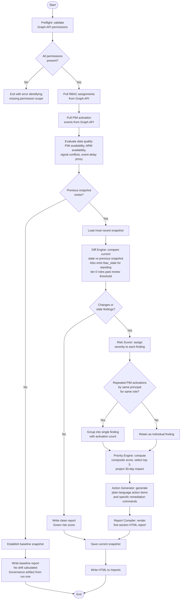

# Product Thinking: IAM Risk Digest

This document covers the design rationale behind IAM Risk Digest: why the problem was framed this way, why existing tooling was considered insufficient, which capabilities were deliberately excluded and why, and how the priority, scoring, and data quality systems were designed. For install and run steps, see [docs/user-guide.md](docs/user-guide.md). The technical build specification lives in [README.md](README.md).

---

## Problem Framing

Cloud identity permissions have no natural expiry mechanism. When an engineer gets elevated access during an incident, the ticket closes but the access does not. When a startup moves fast and assigns subscription-level Contributor roles to avoid scoping delays, those assignments compound quietly as the team grows. When a PIM activation expires in the workflow but the underlying session persists, nothing in the default tooling flags it. Beyond drift from active changes, there is a second category: standing tier-0 directory roles that have simply never been reviewed, where nothing changed between snapshots but the assignment has been present for months.

The consequence is a growing gap between the access an organization believes its users have and the access they actually have. That gap becomes visible in three scenarios: a security audit requesting evidence of access reviews, a breach investigation tracing the attack path through an over-permissioned identity, or a compliance certification process requiring access control documentation that does not exist. The cost of detecting this gap early is low. The cost of discovering it through one of those three scenarios is not.

---

## Why Existing Tooling Falls Short

The problem is not that tooling is absent. It is that the available tooling produces output for identity engineers and assumes the reader can navigate Entra ID, interpret role definition hierarchies, and write KQL against Log Analytics. The person who carries organizational accountability for access risk is usually a manager who does neither.

**Privileged Identity Management** governs just-in-time access well for roles that flow through its workflows. It does not see direct RBAC assignments made outside its scope, which are common in any environment that predates a PIM rollout or operates under time pressure. Its reporting interface is designed for identity administrators.

**Entra ID Access Reviews** support scheduled review cycles but require manual configuration per cycle, produce output that expects IAM familiarity, and offer no combined view of directory role assignments alongside PIM activation state.

**Azure Monitor and Log Analytics** are powerful but require query expertise. The signal-to-noise ratio of raw audit logs without processing is too high for a manager to act on.

The shared gap across all three: none surfaces a prioritized, plain-language answer to the question a manager actually needs answered. What changed, what is risky, and what do I do about it.

---

## User and Persona Decision

The tool is designed for the IT Operations Manager or Engineering Manager at a company running workloads on Azure without a dedicated identity security function, typically 50 to 500 people. This person owns operational and compliance risk across their team's infrastructure and does not have time to become an IAM expert to do it.

The alternative persona considered was the IAM Security Engineer. That persona was dropped because a security engineer can already navigate the tooling that exists. Building for them produces a convenience layer over Entra ID rather than a capability that does not currently exist. The manager persona forces the output to be clear, prioritized, and actionable, which is a harder design constraint and a more defensible product position.

Two organizational segments shaped the v1 scope decision. For startups, the acute pain is operational overhead: access reviews are informal or nonexistent, and the manager needs structure and automation. For enterprise organizations, the pain is compliance and security posture: formal requirements, audit evidence, and risk reduction. The report serves both through a layered structure. The Decision Summary and Action Items serve the startup manager who needs to act without IAM expertise. The Audit Log serves the enterprise compliance lead who needs evidence. v1 was scoped and tested against the startup segment because that environment is simpler to model and faster to validate. Enterprise-specific capabilities are planned for v2.

---

## What Was Deliberately Not Built

| Excluded | Rationale |
|---|---|
| What-if blast simulation | Depends on Azure Resource Graph and tagging quality. Wrong answers harm trust. Deferred until a reliability validation story exists. |
| Email and ticketing integration | External failure surfaces and scope creep. The file output model stays reliable without external dependencies. |
| Hosted dashboard | Contradicts the zero-infrastructure deployment model. Snapshot JSON files can feed a future UI layer. |
| Multi-tenant orchestration | Different authentication and data model from single-tenant. Single-tenant v1 first. |
| Database | Local snapshot files match the lightweight script-plus-artifact deployment model. |
| `AuditLog.Read.All` permission | Event delay transparency is achieved with a `createdDateTime` proxy. Adding a third permission scope expands the consent surface without materially improving v1 output quality. |

---

## Success Criteria

These are the operational outcomes v1 is designed to move.

- A manager can read Decision Summary and Executive Summary in under ten minutes without opening any Azure portal.
- Elevated or drifting access is classified, scored, and ranked rather than delivered as raw API rows.
- Standing tier-0 directory roles that have never been reviewed are surfaced even when nothing changed between runs, via the `rbac_stale` finding type.
- Data quality gaps are explicit when PIM, ARM, or timing signals are incomplete, so the manager knows the coverage boundary of each scan.
- Every run produces a report, including the baseline run, so the governance record starts from day one.

---

## Scoring and Priority Design

### Finding Types

The diff engine produces twelve finding types. Eleven are change-based, detected by comparing the current snapshot against the previous one. The twelfth, `rbac_stale`, is posture-based: it flags tier-0 directory roles (Global Administrator, Privileged Role Administrator, and equivalent) where `createdDateTime` is known, the assignment is not new this cycle, and the standing age exceeds `STALE_RBAC_THRESHOLD_HOURS`. This catches the "nobody touched this Global Admin for six months" scenario that pure diffing misses.

`STALE_RBAC_THRESHOLD_HOURS` serves a dual role: it sets the standing review threshold for `rbac_stale` and it sets the medium-versus-low severity boundary for `rbac_new` (new assignments older than this threshold score medium; newer ones score low).

### Risk Scoring

Findings are assigned severity using a rule set where the first matching rule wins. High-signal finding types (PIM bypass, orphaned access, service principal elevation, very old PIM activations, eligible-and-active duplicates) are ordered before softer rules. The ordering is deliberate: severity should reflect the risk profile of the finding type, not just the age of the event.

### Priority Engine

Risk scoring assigns severity to individual findings. The priority engine ranks all findings against each other to answer a different question: given everything in this report, where should the manager's attention go first?

```
priority_score = (severity_weight × 4) + min(age_hours / 24, 15) + principal_type_weight

severity_weight:        high = 10,  medium = 5,  low = 1
age_weight:             min(age_hours / 24, 15)     [capped at 15 days]
principal_type_weight:  ServicePrincipal = 5,  User = 2,  Group = 1
```

The severity multiplier is set high enough to guarantee severity dominance across all age and principal type combinations. Age and blast-radius signals inform ranking within a severity tier; they do not override the risk scorer's severity judgment across tiers.

The age cap at 15 days reflects the reality that urgency signal plateaus after two weeks. Uncapped age accumulation would cause old low-priority findings to crowd out more recent, higher-severity ones over time.

Service principals score 5 because they have no MFA layer, no behavioral anomaly detection baseline, and no HR-driven offboarding process. A compromised service principal operates silently in ways a compromised user account does not. Users score 2 because MFA, login anomaly detection, and structured offboarding provide meaningful mitigation layers even when access is over-provisioned.

The top three findings by priority score are surfaced in the Decision Summary with a 30-day impact projection for each. The projection is a structured estimate based on finding type, intended to make the cost of inaction concrete for a manager who may not have intuition for identity risk.

---

## Data Quality and Transparency

The tool surfaces four data quality signals alongside findings rather than presenting incomplete data as complete.

**PIM data availability.** Flagged when the PIM API returns no results, either because PIM is not configured or the permission scope is absent. PIM-specific finding types are skipped, and the absence is surfaced as a medium-severity `pim_absent` finding.

**ARM data availability.** Flagged when no subscription ID is configured, so the manager knows resource-level RBAC assignments were not included in the scan.

**Signal conflict count.** Tracks cases where a role appears removed in the RBAC snapshot but still active in the PIM activation log. Both findings are retained independently and the conflict count is reported in the Data Quality Notice.

**Event delay detection.** Compares the most recent `createdDateTime` across collected Graph assignments and ARM `createdOn` values against current UTC. When the gap exceeds two hours, the report notes that very recent changes may not appear until the next run. This is a proxy heuristic, not a direct audit log query. If `AuditLog.Read.All` is granted in the future, the heuristic in `diff_engine.py` can be replaced with a `auditLogs/directoryAudits` tail query without touching any other module.

The Data Quality Notice in the Executive Summary uses neutral language. These are transparency statements, not error states.

---

## Deployment Constraints and Assumptions

These are the operational boundaries of v1. They are not gaps to fix; they are deliberate constraints that define the deployment model.

**Two Graph API permissions required.** `Directory.Read.All` and `RoleManagement.Read.Directory` are the minimum. Admin consent must be granted by a Global Administrator before the tool can run. `AuditLog.Read.All` is explicitly not required in v1.

**ARM support is optional.** Subscription-level RBAC detection requires a configured `AZURE_SUBSCRIPTION_ID` and ARM Reader access. Without it, the tool operates on directory-role and PIM data only. ARM absence is reported in the Data Quality Notice rather than treated as a failure condition.

**Audit log availability is estimated.** Event delay uses `createdDateTime` on assignments as a proxy for pipeline freshness. The tool continues to diff snapshot state and flags estimated lag in the Data Quality Notice when the gap is significant.

**Single-tenant only.** One `.env` configuration maps to one Entra ID tenant. There is no cross-tenant orchestration in v1.

**Local filesystem persistence.** Snapshots are JSON files written under `snapshots/`. Snapshot filenames use hyphens instead of colons in the ISO timestamp to remain valid on Windows NTFS while still sorting correctly. There is no database dependency.

**No hosting required.** The tool runs as a Python process on any machine with network access to `graph.microsoft.com` and optionally `management.azure.com`. The scheduler is a blocking process rather than a daemon. Persistent scheduling requires an external mechanism documented in `docs/scheduling.md`.

**Read-only.** The tool makes no write, update, or delete calls to any Microsoft API. It writes only to `snapshots/` and `reports/` on the local filesystem.

---

## Processing Logic



---

## Roadmap

**v2** targets the enterprise and MNC segment, where the primary value driver shifts from overhead reduction to compliance posture. Planned additions: email delivery, ServiceNow and Jira integration for automated ticket creation, multi-tenant support, and a 90-day historical trend view of risk score movement.

**v3** is contingent on Azure Resource Graph integration and a simulation validation layer. With those in place, the what-if simulation becomes viable: modeling downstream service impact before a remediation action is taken. The feature depends on reliable dependency mapping and output validation before it can be surfaced safely to non-technical users.
